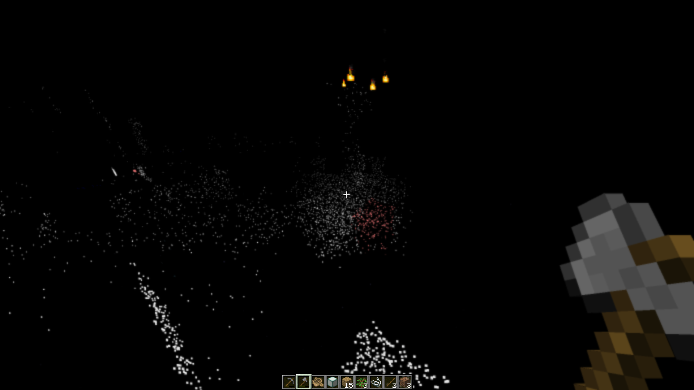

LIDAR is a mod that dramatically transforms Minecraft's visibility into an environment of dots and particles projected from the player onto surfaces around them.

> This is based on the game ["Lidar.exe" by KenForest](https://kenforest.itch.io/lidar-exe) - if you enjoy this mod, be sure to check out the original game!



### Music

This mod additionally customizes the in-game music - most of the included tracks can be found at [soundcloud.com/fennifith](https://soundcloud.com/fennifith) or [fennifith.bandcamp.com](https://fennifith.bandcamp.com) :)

### Configuration

For now, the mod's configuration can be edited manually in `config/lidar-lidarconfig.json`. Be aware that invalid values in this file can crash the game. An in-game config menu should be added to address this in a future update.

```json
{
  // whether the mod rendering is enabled
  "isActive": true,
  // a mapping of block identifier -> particle color
  "blockColorMap": {
    "default": "#FFFFFF",
    "minecraft:water": "#0000FF",
    "minecraft:seagrass": "#0000FF"
  },
  // a mapping of entity identifier -> particle color
  "entityColorMap": {
    "default": "#ff7e7e",
    "peaceful": "#61cf66",
    "hostile": "#ff7e7e",
    "minecraft:enderman": "#7e009e",
    "minecraft:creeper": "#008f07"
  },
  // entities that are excluded from the particle system, and should be rendered normally
  "entityRender": [
    "minecraft:item",
    "minecraft:item_frame",
    "minecraft:glow_item_frame",
    // if you remove the ender dragon from this list, it will actually crash the game when it renders - so don't do this :)
    "minecraft:ender_dragon"
  ],
  // whether particles should follow entities as they move (looks super cheesy, turned off by default)
  "entityParticleFollow": false,
  // if enabled, particles project onto entity models more accurately, at the cost of performance
  "entityParticleModel": true,
  // if enabled, particles from other entities will render on the current player (blocks the player's view, turned off by default)
  "entityParticlesOnSelf": false,
  // amount of lidar projections created by non-player entities, per tick
  "entityLidarCount": 20,
  // distance (blocks) that lidar particles should be cast
  "lidarDistance": 10.0,
  // radius/spread of particles, in degrees
  "lidarSpread": 30.0,
  // amount of lidar projections created for player entities, per tick
  "lidarCount": 100,
  // amount of ticks that particles cast onto blocks should remain
  "lidarDurationBlock": 100,
  // amount of ticks that particles cast onto entities should remain
  "lidarDurationEntity": 20,
  // whether a bloom effect should be rendered for the lidar particles
  "lidarBloom": true
}
```

#### Keybinds

This mod has one keybind to toggle between particle/normal rendering modes, which is bound to `K` by default. You can change this in "options > controls > key binds".

### Mod Compatibility

This mod is likely incompatible with most other fabric mods due to how it modifies the rendering logic. It is known to be incompatible with Sodium/Iris/etc. Use at your own risk.

## License

```
Copyright (c) 2023 James Fenn

This Source Code Form is subject to the terms of the Mozilla Public
License, v. 2.0. If a copy of the MPL was not distributed with this
file, You can obtain one at https://mozilla.org/MPL/2.0/.
```

